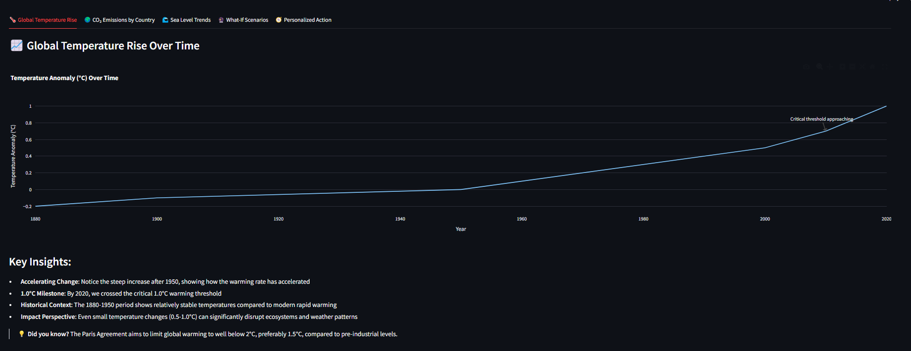
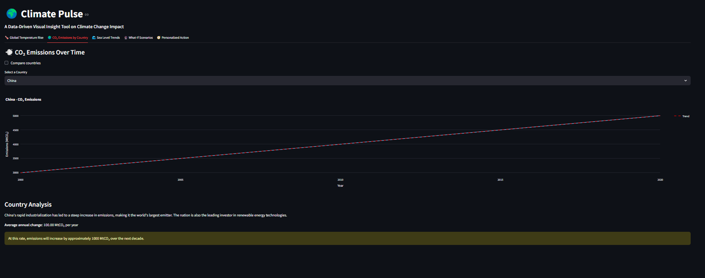
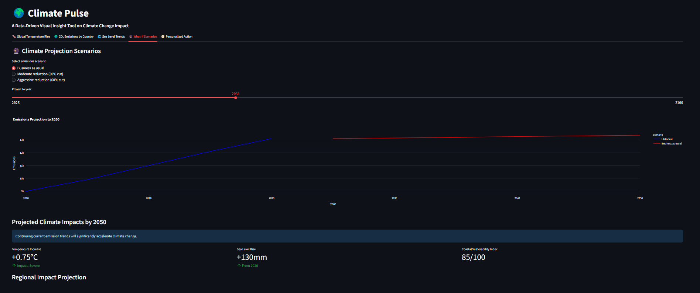
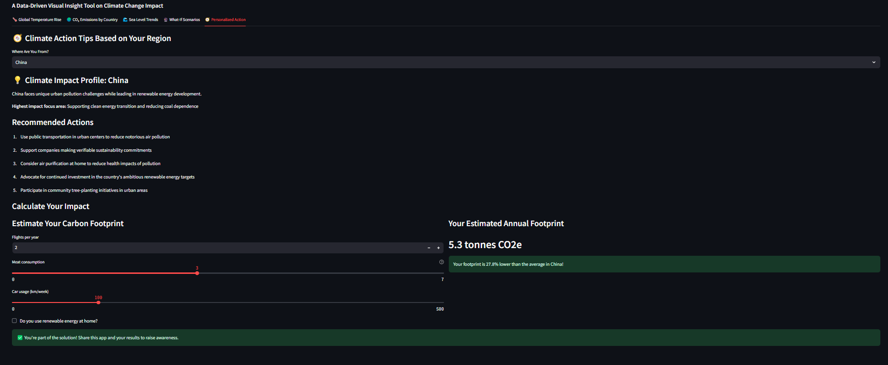

# climate-pulse-insight
 A dynamic Streamlit-powered dashboard providing interactive, data-driven insights into climate change — featuring global CO₂ trends, temperature rise, sea level changes, and personalized climate action tips.

# 🌍 Climate Pulse: Interactive Climate Change Visualization Dashboard

[](https://opensource.org/licenses/MIT)
[](https://www.python.org/downloads/)
[](https://share.streamlit.io/)

## 📊 Overview

**Climate Pulse** is an educational data visualization dashboard that demonstrates how interactive tools can make climate change concepts more accessible and engaging. This project showcases my skills in data visualization, Python programming, and UI/UX design using simplified climate data models.

## ✨ Features

- 🌡️ **Global Temperature Rise Analysis**: Visualize temperature anomaly trends with interactive charts
- 🌍 **Country-specific CO₂ Emissions**: Compare emissions between countries with interactive visualizations 
- 🌊 **Sea Level Rise Projections**: Explore sea level changes and potential regional impacts
- 🔮 **What-If Scenarios**: Model different emission reduction scenarios using simplified projections
- 🧭 **Personalized Action Recommendations**: Explore region-specific climate action suggestions
- 📱 **Responsive Design**: Works on desktop and mobile devices

## 🚀 Getting Started

### Prerequisites

- Python 3.6+
- Pip package manager

### Installation

1. Clone the repository:
```bash
git clone https://github.com/yourusername/climate-pulse.git
cd climate-pulse
```

2. Create a virtual environment:
```bash
python -m venv venv
source venv/bin/activate  # On Windows: venv\Scripts\activate
```

3. Install dependencies:
```bash
pip install -r requirements.txt
```

4. Run the application:
```bash
streamlit run app.py
```

5. Open your browser and go to:
```
http://localhost:8501
```

## 📊 About the Data

This project uses **simplified educational datasets** created for demonstration purposes. The data models are based on general climate trends but are not intended for scientific analysis or policy decisions. The simplified data helps focus on demonstrating:

- Interactive visualization techniques
- Dashboard design principles
- User experience with climate information
- Data storytelling approaches

For actual climate research or reference, please consult scientific sources such as NASA, NOAA, or the IPCC.

## 📸 Screenshots

### Temperature Analysis


### CO₂ Emissions Comparison


### Sea Level Projections


### What If Scenarios


### Personalised Actions


## 🛠️ Technologies Used

- **Streamlit**: Frontend interactive dashboard
- **Pandas**: Data manipulation and analysis
- **Plotly**: Interactive data visualizations
- **NumPy**: Numerical computing and simple projections

## 💡 Project Purpose

This portfolio project demonstrates my ability to:
- Build interactive data dashboards
- Create engaging visualizations for complex topics
- Design user-friendly interfaces
- Implement responsive web applications
- Communicate data insights effectively

## 🎯 Future Enhancements

- [ ] Replace simplified data with real climate datasets
- [ ] Add more detailed visualizations and interaction options
- [ ] Implement machine learning components for trend analysis
- [ ] Add responsive design improvements for mobile users
- [ ] Create additional educational modules

## 🤝 Contributing

Contributions are welcome! Here's how you can help improve this project:

1. Fork the repository
2. Create your feature branch (`git checkout -b feature/amazing-feature`)
3. Commit your changes (`git commit -m 'Add some amazing feature'`)
4. Push to the branch (`git push origin feature/amazing-feature`)
5. Open a Pull Request

### 💧 Data Contributions

One of the most valuable ways to contribute to this project is by helping replace the simplified data with genuine climate datasets:

- If you have experience with climate data sources, consider contributing authentic datasets from NASA, NOAA, IPCC, or other scientific organizations
- Help implement data processing for real-world climate data sources
- Improve data visualization accuracy by incorporating genuine climate measurements
- Add proper citations and data provenance information
- Create data processing pipelines for regular updates from scientific sources

Please ensure all contributed data comes from reputable scientific sources and includes proper attribution.

## 📄 License

This project is licensed under the MIT License - see the LICENSE file for details.

## 📬 Contact

Project Link: [https://github.com/pauluwilson10/climate-pulse-insight](https://github.com/pauluwilson10/climate-pulse-insight)

## 🙏 Acknowledgments

- Inspiration from climate data visualization projects
- Streamlit team for their excellent framework
- Open source visualization libraries

---

❗ **Disclaimer**: This application uses simplified data models for educational and demonstration purposes only. It is not intended for scientific research, policy decisions, or as a source of climate information. For accurate climate data, please consult official scientific sources such as NASA, NOAA, or the IPCC.

